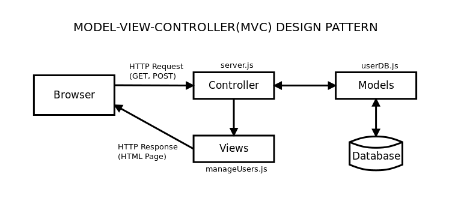

## Simple Model-View-Controller Example

**Model-View-Controller (MVC)** is a software design pattern that splits an application into three connected parts: the **Model (data and logic)**, the **View (user interface)**, and the **Controller (intermediary handles user input and interacts with the Model)**.In this server-side Node.js/Express application, using EJS (Embedded JavaScript templates and Bootstrap for the View templates:
* the server handles the routing and the controller
* processing the HTTP Request data
* reading it or writing it to the database using the Model
* injects the response into an EJS template styled with Bootstrap CSS
* sends fully rendered HTML back to the browser.

